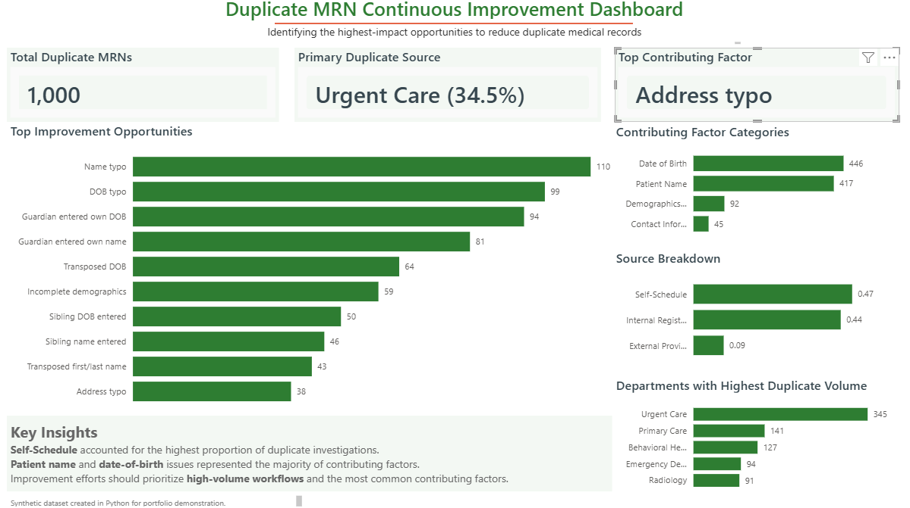
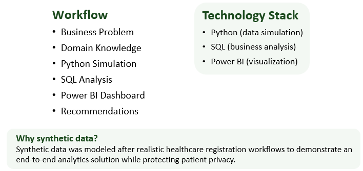
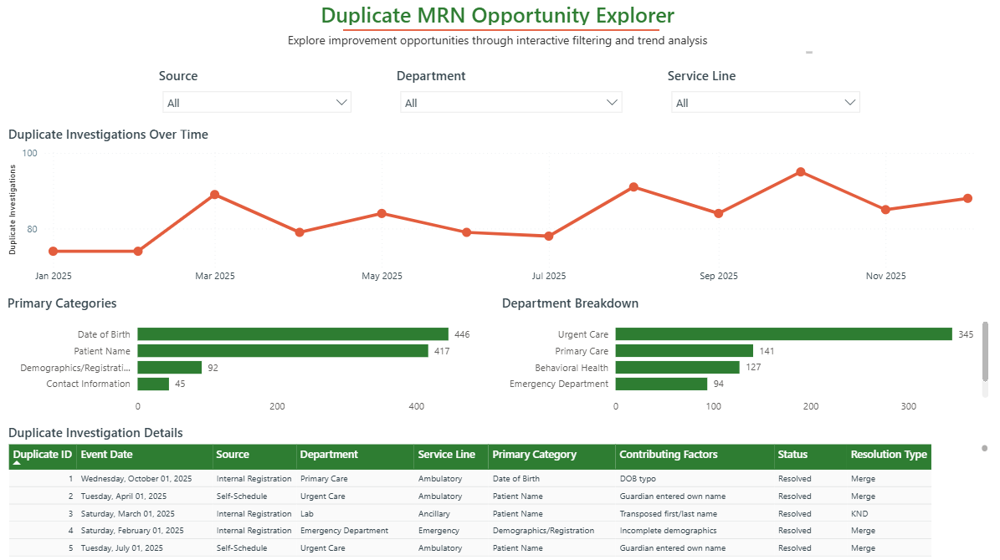

# Healthcare Duplicate MRN Continuous Improvement Analysis

## Overview

Duplicate medical record numbers (MRNs) create operational inefficiencies, increase duplicate investigation workload, and can contribute to patient safety risks when patient information becomes fragmented across multiple records.

This project demonstrates an end-to-end healthcare analytics workflow that uses Python, SQL, and Power BI to simulate realistic duplicate MRN investigations, analyze duplicate trends, and identify actionable process improvement opportunities.

Rather than serving as a static reporting solution, this project emphasizes continuous improvement by translating analytical findings into actionable operational recommendations.

## Business Problem

Healthcare organizations routinely investigate duplicate medical record numbers created during patient registration. Duplicate records require manual investigation and merge activities, increasing operational workload while introducing patient safety risks.

The objective of this project was to identify the highest-impact opportunities for reducing duplicate MRNs through analysis of duplicate investigation data and development of an interactive quality improvement dashboard.

## Project Objectives

- Simulate realistic duplicate MRN investigations using synthetic healthcare data.
- Analyze duplicate trends using SQL.
- Build an executive Power BI dashboard.
- Develop an interactive Opportunity Explorer for stakeholders.
- Recommend evidence-based process improvements.

## Technology Stack

- **Python** – Generated a realistic synthetic duplicate MRN dataset using weighted probability simulation and healthcare business rules.
- **SQL** – Analyzed duplicate investigations using business-driven queries, aggregations, and trend analysis.
- **Power BI** – Developed executive and interactive dashboards to identify improvement opportunities.

## Project Workflow

## Interactive Dashboard

## Key Findings

- Self-Schedule accounted for the highest proportion of duplicate investigations (34.5%).
- Patient Name and Date of Birth represented the majority of contributing factors.
- Registration data accuracy represented the greatest opportunity for reducing duplicate MRNs.

## Recommended Process Improvements

Based on the analytical findings, five targeted process improvements were identified:

- Improve Self-Schedule registration workflows.
- Reinforce the Reliable Search Method for external providers.
- Reinforce STAR (Stop, Think, Act, Review) during registration.
- Provide targeted Duplicate MRN training for frequent duplicate creators.
- Monitor department performance using real-time dashboards and quarterly quality improvement rounding.

## Future Enhancements

- Expand the project into a normalized relational SQL database.
- Develop automated ETL pipelines for dashboard refreshes.
- Add statistical trend analysis and anomaly detection.
- Simulate larger multi-facility healthcare datasets.